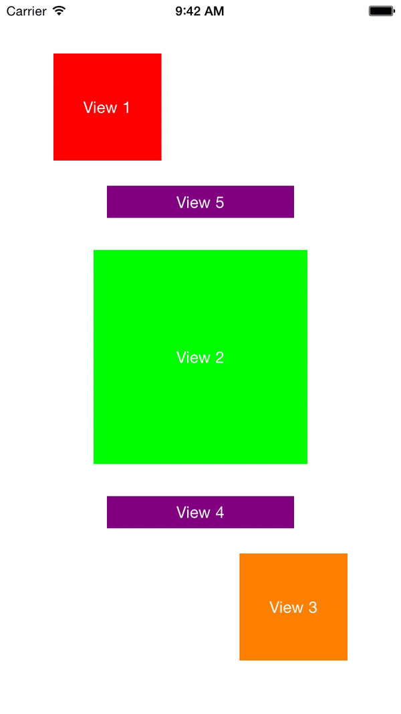

# ConstraintLib

Swift library that simplifies interacting with Xcode Constraints by adding the following features:

- Add constraints in swift with a understandable function
- Find constraints from code
- Animate swift constraints changes
- Remove constraints from it's superview

This library now requires Swift 3.

## Background Info
I love making custom views and with custom animation. But everytime I do so I find myself writing a lot of constraint code just to manage subviews, create constraint properties and perform animations. Using this category / lib, I managed to make my custom views cude a lot more simple.

## Usage
This module contains extensions on: `UIView`, `UIViewController` & `NSLayoutConstraint`. 

### Example 1: Create a view with NSLayoutConstraint properties

When a view has a frame you can easily pin the edges to its superview with the frame's values.
Always make sure you first add the view to its superview before pinning constraints.

	let newView = UIView(frame: CGRect(x: 50.0, y: 50.0, width: 100.0, height: 100.0))
	self.view.addSubview(newView)
	let topConstraint = newView.pin(.top)
	let leftConstraint = newView.pin(.left)
	let heightConstraint = newView.pin(.height)
	let widthConstraint = newView.pin(.width)

### Example 2: Create a view without NSLayoutConstraint properties

If you don't need the constraint properties, then this syntax can also be used.

	let newView = UIView(frame: CGRect(x: 50.0, y: 50.0, width: 100.0, height: 100.0))
	self.view.addSubview(newView)
	newView.pin([.top, .left, .height, .width]

### Example 3: Create a view and provide constant values

Alternatively, values can also be provided in the pin command.

Full Format:

	let newView1 = UIView()
	self.view.addSubview(newView1)
	let topConstraint = newView1.pin(.top, constant: 50.0)
	let leftConstraint = newView1.pin(.left, constant: 50.0)
	let heightConstraint = newView1.pin(.height, constant: 100.0)
	let widthConstraint = newView1.pin(.width, constant: 100.0)

Compact format:

	let newView2 = UIView()
	self.view.addSubview(newView2)
	newView2.pin([.top: 50.0, .left: 50.0, .height: 100.0, .width: 100.0]

### Example 4: Create a view with a relation to another view

To create a view `newView2` where it's top will stick 30 pixels away from the bottom of view `newView1 `

	let newView1 = UIView()
	self.view.addSubview(newView1)
	newView1.pin([.height, .width, .centerX, .centerY])
	
	let newView2 = UIView()
	self.view.addSubview(newView2)
	newView2.pin([.left: 100.0, .right: 100.0, .height: 30.0, .topTo(newView1): 30.0])

### Example 5: Find a NSLayoutConstraint from a view

Constraints can be found in the following way

	let leftConstraint = view1.constraint(.left)
	let rightConstraint = view1.constraint(.right)
	let topConstraint = view1.constraint(.top)
	let bottomConstraint = view1.constraint(.bottom)
	let widthConstraint = view1.constraint(.width)
	let heightConstraint = view1.constraint(.height)
	let centerXConstraint = view1.constraint(.centerX)
	let centerYConstraint = view1.constraint(.centerY)
	
	let leftToView2Constraint = view1.constraint(.leftTo(view2))
	let rightToView2Constraint = view1.constraint(.rightTo(view2))
	let topToView2Constraint = view1.constraint(.topTo(view2))
	let bottomToView2Constraint = view1.constraint(.bottomTo(view2))
	
	let equalwidthToView2Constraint = view1.constraint(.equalWidth(view2))
	let equalHeightToView2Constraint = view1.constraint(.equalHeight(view2))

### Example 6: Animate constraint changes

The animateConstraints functions works similar to the `UIView.animate(withDuration: TimeInterval, animations: Swift.Void)` 
With as only exception that the animateConstraints must be called on the highest UIView, to make it easier this function has also been added as extension to `UIViewController`.
Next to that there is an optional block for normal animation, one for constraint animations and an optional completion block.

    animateConstraints(duration: 1.0, constraints: {
        
        /* Only contraint changes will be animated in this block */
        
        view1?.constraint(.left)?.constant = 150.0
                        
    }, animations: {
        
        /* Other changes will be animated from this block */
        
        view1?.backgroundColor = UIColor.blue
    })
    
### Example 7: Remove a constraint

Remove a left or leading constraint

	view1.constraint(.left)?.remove()

Remove a horizontal constraint from the right side of `view1` to the left side of `view2`

	view1.constraint(.rightTo(view2))?.remove()
    
### More demos?

Clone the repository, open `ConstraintLib.xcodeproj` and build the demo project

## Development Info
Please document code changes in unit tests and make sure all tests are green.

## License
This project is released under the [Apache-2.0 license](LICENSE.txt).
